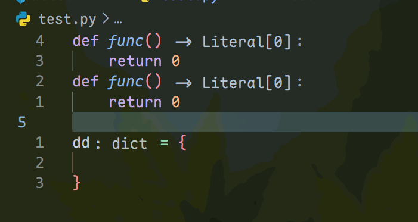
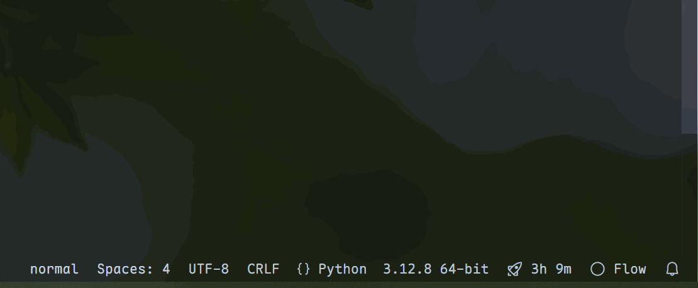

# Neovim Ui Indicator

## show

In normal mode, there will be a blue bar, and colors can also be set in other modes.



You can close it by clicking or commanding.



## VSCode set

default value:

```json
"neovim-ui-indicator.normalColor": "#71B4DD30",
"neovim-ui-indicator.insertColor": "#71B4DD00",
"neovim-ui-indicator.visualColor": "#71B4DD00",
"neovim-ui-indicator.disableColor": "#71B4DD00",
```

## neovim set

```lua
vim.api.nvim_create_autocmd("ModeChanged", {
    pattern = "*",
    callback = function()
        local mode = vim.api.nvim_get_mode().mode
        if mode == "i" then
            require('vscode').action("neovim-ui-indicator.insert")
        elseif mode == "v" then
            require('vscode').action("neovim-ui-indicator.visual")
        elseif mode == "n" then
            require('vscode').action("neovim-ui-indicator.normal")
        end
    end,
})
```

## cursor center

This allows you to c-u/c-d and then center the mouse.

```lua
    require('vscode').action("neovim-ui-indicator.cursorCenter")
```

## Not related to plugins, but recommended

### better scroll

vscode keybindings.json

```json
	{
		"command": "vscode-neovim.send",
		"key": "ctrl+u",
		"when": "editorTextFocus && neovim.ctrlKeysNormal.u && neovim.init && neovim.mode != 'insert' && editorLangId not in 'neovim.editorLangIdExclusions'",
		"args": "<C-u>"
	},
	{
		"command": "vscode-neovim.send",
		"key": "ctrl+d",
		"when": "editorTextFocus && neovim.ctrlKeysNormal.d && neovim.init && neovim.mode != 'insert' && editorLangId not in 'neovim.editorLangIdExclusions'",
		"args": "<C-d>"
	},
	{
		"command": "vscode-neovim.send",
		"key": "ctrl+f",
		"when": "editorTextFocus && neovim.ctrlKeysNormal.f && neovim.init && neovim.mode != 'insert' && editorLangId not in 'neovim.editorLangIdExclusions'",
		"args": "<C-f>"
	},
	{
		"command": "vscode-neovim.send",
		"key": "ctrl+b",
		"when": "editorTextFocus && neovim.ctrlKeysNormal.b && neovim.init && neovim.mode != 'insert' && editorLangId not in 'neovim.editorLangIdExclusions'",
		"args": "<C-b>"
	},
	{
		"key": "ctrl+d",
		"command": "-vscode-neovim.ctrl-d",
		"when": "editorTextFocus && neovim.ctrlKeysNormal.d && neovim.init && neovim.mode != 'insert' && editorLangId not in 'neovim.editorLangIdExclusions'"
	},
	{
		"key": "ctrl+u",
		"command": "-vscode-neovim.ctrl-u",
		"when": "editorTextFocus && neovim.ctrlKeysNormal.u && neovim.init && neovim.mode != 'insert' && editorLangId not in 'neovim.editorLangIdExclusions'"
	},
	{
		"key": "ctrl+b",
		"command": "-vscode-neovim.ctrl-b",
		"when": "editorTextFocus && neovim.ctrlKeysNormal.b && neovim.init && neovim.mode != 'insert' && editorLangId not in 'neovim.editorLangIdExclusions'"
	},
	{
		"key": "ctrl+f",
		"command": "-vscode-neovim.ctrl-f",
		"when": "editorTextFocus && neovim.ctrlKeysNormal.f && neovim.init && neovim.mode != 'insert' && editorLangId not in 'neovim.editorLangIdExclusions'"
	},
```

init.lua

```lua
vim.keymap.set({ "n", "x" }, "<C-u>", function()
    local visibleRanges = require('vscode').eval("return vscode.window.activeTextEditor.visibleRanges")
    local height = visibleRanges[1][2].line - visibleRanges[1][1].line
    for i = 1, height*2/3 do
        vim.api.nvim_feedkeys("k", "n", false)
    end
    require('vscode').action("neovim-ui-indicator.cursorCenter")
end)
vim.keymap.set({ "n", "x" }, "<C-d>", function()
    local visibleRanges = require('vscode').eval("return vscode.window.activeTextEditor.visibleRanges")
    local height = visibleRanges[1][2].line - visibleRanges[1][1].line
    for i = 1, height*2/3 do
        vim.api.nvim_feedkeys("j", "n", false)
    end
    require('vscode').action("neovim-ui-indicator.cursorCenter")
end)
vim.keymap.set({ "n", "x" }, "<C-f>", function()
    local visibleRanges = require('vscode').eval("return vscode.window.activeTextEditor.visibleRanges")
    local height = visibleRanges[1][2].line - visibleRanges[1][1].line
    for i = 1, height do
        vim.api.nvim_feedkeys("j", "n", false)
    end
    require('vscode').action("neovim-ui-indicator.cursorCenter")
end)
vim.keymap.set({ "n", "x" }, "<C-b>", function()
    local visibleRanges = require('vscode').eval("return vscode.window.activeTextEditor.visibleRanges")
    local height = visibleRanges[1][2].line - visibleRanges[1][1].line
    for i = 1, height do
        vim.api.nvim_feedkeys("k", "n", false)
    end
    require('vscode').action("neovim-ui-indicator.cursorCenter")
end)
```
